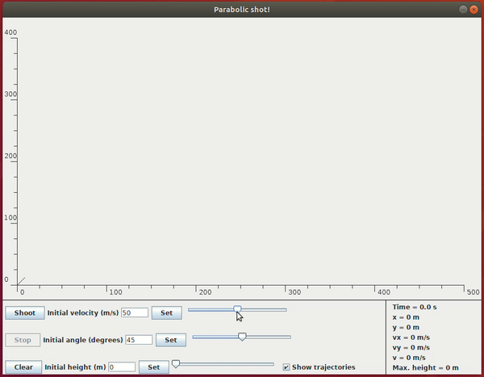

# Parabolic Shot

Projectile motion is a form of motion experienced by an object or particle (a projectile) that is thrown near the Earth's surface and moves along a curved path under the action of gravity only (in particular, the effects of air resistance are assumed to be negligible). This Java program is a parabolic shots simulator.

## Program features

* The initial height, initial velocity or shot angle can be specified using buttons and text fields or sliders.



* The program shows some important information of the current shot.


* The trajectories of the shots can be visualized or not.


* A shot can be stopped and restarted during it's simulation.


* The axis are scaled with largest shots.


## Execution

For execution, try the command below:
```bash
  java -jar ParabolicShot.jar
```

## Author

Daute Rodríguez Rodríguez
